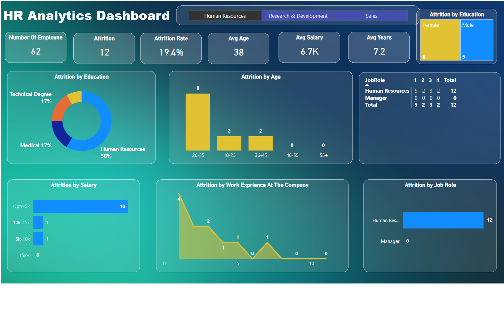

# HR_Analytics_Report

# HR Analysis Report Dashboard - Power BI

This repository showcases a comprehensive HR analysis project using Power BI. The analysis tackles key HR metrics such as employee turnover, trends in employee departures, and the underlying reasons behind those trends. The data is cleaned, transformed, and visualized in Power BI, with the goal of providing actionable insights for organizational growth.

## Overview

The project focuses on employee turnover, with a detailed analysis of:
- Employee retention rates
- Reasons behind departures
- Trends over time
- Key factors affecting employee satisfaction

The resulting visualizations offer valuable insights for HR professionals and organizational leaders, helping them make data-driven decisions to improve employee retention and overall workforce management.

## Key Features
- **Data Cleaning**: Raw employee data was cleaned and pre-processed to ensure accuracy and consistency.
- **Data Transformation**: Relevant data points were transformed into meaningful formats for analysis.
- **Data Visualization**: Interactive visualizations were created using Power BI to highlight turnover trends and employee satisfaction.

## Dashboard Screenshot

Here is a preview of the dashboard created in Power BI:

